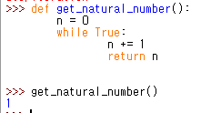
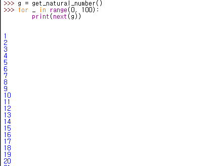

# 20.01.11 월요일 Python의 yield 구문

## 일반적인 함수의 Return

- return은 함수를 종료하고 값을 반환한다

- ```python
  def get_natural_number():
      n = 0
      while True:
          n += 1
          return n
  ```

  - 위 함수의 경우, 첫 return으로 1를 반환하고 함수가 종료된다
  - 


## 함수의 yield 구문

- yield를 사용하면 현재 값을 내보내고 함수가 계속된다

- ```python
  def get_natural_number():
      n = 0
      while True:
          n += 1
          yield n
  ```

- 위 함수의 경우 실행시 제너레이터가 된다

  - ```
    get_natural_number()
    <generator object get_natural_number at 0x000001D01CB2CC48>
    ```

- 값을 생성하려면 next()로 추출하여야 한다

  - 
  - 위와 같이, 지정된 수만큼 반복한다.